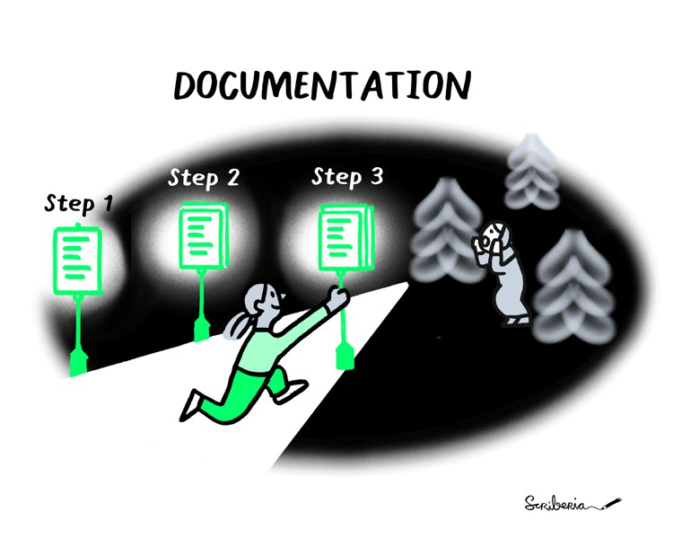

### Provide a Process for Documentation

*Documentation as a guiding light for people who may feel lost otherwise. The Turing Way project illustration by Scriberia for The Turing Way Community Shared under CC-BY 4.0 License. Zenodo. http://doi.org/10.5281/zenodo.3332807*

Most researchers find documentation daunting, as they think that research-related responsibilities are already overwhelming for them.
It's obvious that they see documentation as an  'added labour' and not important enough for carrying out a research design, implementation, analysis or publication work. 

The reality is that documentation is an integral part of all research processes, from start to finish.

> ## A systematic process for documentation is more than a formal book-keeping practice because it: 
> * allows everyone in your research to understand the research direction and track progress;
> * adds validity to your research work when systematically built on published peer-reviewed work;
> * communicates different ways to contribute, enabling diverse participation in the co-development;
> * upholds practices to ensure equity, diversity and inclusion;
> * recognises contributions fairly;
> * gives and shares credits for all work;
> * tracks the history of what worked or what did not work;
> * creates transparency about early and intermediate research outcomes;
> * makes auditing easy for funders, advisors or data managers;
> * helps reframe research narratives by connecting different work;
> * explains all decisions and stakeholders impacted by that;
> * gives the starting point for writing manuscript and publication; and more!
>
{: .checklist}

### Facilitating Documentation in your Team

> ## NOTE
> 
> Whatever your approach is, be firm about making documentation a shared responsibility so that this job does not solely fall on the shoulders of early career researchers, members from traditionally marginalised groups or support staff.
{: .callout}

The biggest question here is probably not 'why' but 'how' to facilitate documentation so that it is not challenging or burdensome for the team members.
Here are a few recommendations to make documentation easier:
- Allocate some time at the beginning of the project to discuss with the main stakeholders of the project about what should be documented.
- Keep the tasks simple by establishing a shared repository for documentation with standard templates to guide how one should go about documenting their work (*It is always easier to start with a template than an empty sheet!*).
- Add documentation sprint to your project timelines and milestones to make sure that everyone is aware of their importance in the project.
- Create visible ways to recognise and incentivise the process of documenting.
